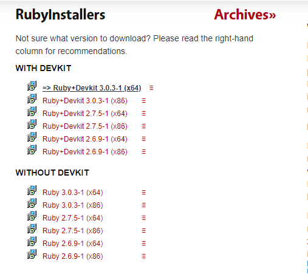

<h1>Hello My name its Gabriel Ramires</h1>
<small style="color: red;">ATTENTION: THIS PAGE IS IN PT-BR please, translate if you looking to a create Websites.</small>

Olá desenvolvedores!\
... esse sera meu ponto de vista sobre o Jekyll e como eu começei a criar um Website!

<h3><a href=".">Back</a></h3>

Sumario:\
<a href="#sobre-criação-de-sites">Sobre Criação de sites</a>\
<a href="#sobre-jekyll">Sobre Jekyll</a>\
<a href="#introdução-com-jekyll-&-criação-de-website">Usando Jekyll</a>

---

# Sobre Criação de Sites

## Sobre & Ferramentas

Bem, a parte de Criação de Websites é a parte que eu gosto e uma das mais "simples" entre aspas em fim, a criação de um Website é necesario aprender Sobre JavaScript, Html, Php e etc Caso queira entrar nesse universo de Websites é necesario saber essas linguagems. Se você prefere mais Html e JavaScript não é necesario saber Php ou ao contrario.

Mas uma coisa legal de Websites é que existe MUITAS ferramentas de desenvolvemento de Websites como exemplo <a target="_blank" href="https://jekyllrb.com">Jekyll</a>, <a target="_blank" href="https://jekyllrb.com">Jekyll</a> é uma ferramenta utilizada para criação de sites simples usando Ruby como linguagem de base, mas não existe só mente <a target="_blank" href="https://jekyllrb.com">Jekyll</a> Existe <a target="_blank" href="https://rubyonrails.org">Ruby On Rails</a> que também é um metodo de criação de site mais complexa

## Hospedagem

O sistema de Hospedagem é utilizado como o nome fala Hospedar a aplicação existe também muitos lugares para fazer isso como uma delas o proprio <a target="_blank" href="https://github.com">Githib</a> com o <a target="_blank" href="https://pages.github.com">Github Pages</a> Tem como você criar um site pelo <a target="_blank" href="https://github.com">Github</a> usando <a target="_blank" href="https://pages.github.com">Github Pages</a> ou Hospedar um Site neles também existe outros metodos pagos e de graça para hospedar o seu Site como VPS _(Servidor Virtual Privado)_, Cloud _(Hospedagem na nuvem)_, <a target="_blank" href="https://www.godaddy.com/pt-br">GoDaddy</a>, <a target="_blank" href="https://umbler.com/br">Umbler</a>, <a target="_blank" href="www.heroku.com">Heroku</a> e muito mais _(NOTA: algumas de graça ou pagas)_.

## Dominio & Dominio Proprio

Bem como o mundo não é um mar de rosas os lugares que hospedam os Websites Precisão de um Proprio dominio como esse: <a target="_blank" href="https://gabrielramires.github.io/MinecraftServerMenu">https://gabrielramires.github.io/MinecraftServerMenu</a> isso é um dominio NÃO PROPRIO sendo assim um dominio que ira aparecer seu nome e o lugar _github.io_. Mas existe um metodo de conseguir mudar esse dominio comprando um dominio exemplos: .com, .org, .co e etc.

# Sobre Jekyll

Uma feramenta que eu uso para criar os meus websites usando o <a target="_blank" href="https://pages.github.com">Github</a> para Hospeda-los

Verifique as informações de <a target="_blank" href="#começar-a-usar-o-jekyll">Começar a usar o Jekyll</a>

  

# Introdução com Jekyll & Criação de Website

---

## <b>Instalação de Ruby</b>

Na pagina de <a target="_blank" href="https://rubyinstaller.org/downloads">Instalação de Ruby</a> você precisarra instalar a verção mais recente de preferencia a versão com WITH DEVKIT _(COM DEVKID)_

---

  

## <b>Usando CMD ou Power Shell</b>

1. Intalando Jekyll em Ruby

   - <line id="scriptline"><line style="color: yellow;">gem</line> install Jekyll</line> 

2. Construindo um Projeto em Jekyll

   - <line id="scriptline"><line style="color: yellow;">jekyll</line> new <line style="color: rgb(0, 162, 255);">"CoolWebsite"</line></line> 

3. Abrindo o Projeto no CMD ou Power Shell

   - <line id="scriptline">cd CoolWebsite</line> 

4. Executando um Servidor Local com Jekyll

   - Execuções:

     1. Normal:

        - <line id="scriptline"><line style="color: rgb(216, 219, 0);">jekyll</line> server</line> 

     2. Com alguma informação a mais:
        - <line id="scriptline"><line style="color: yellow;">jekyll</line> server <line style="color: rgb(46, 46, 46);">--baseurl=''</line></line>\
          <small>_(por exemplo `baseurl` caso você tenha o projeto no Github você tera que alterar o `baseurl` para não gerar erros)_</small>

5. Hospedagem

   Bem... A parte de Hospedagem terei que deixar em branco talvez você use o Github? ou outro lugar em fim aqui algumas documentações sobre hospedagem no github pelo Jekyll:\
   <a target="_blank" href="https://jekyllrb.com/docs/continuous-integration/github-actions/#build-and-deploy">Build And Deploy</a>
