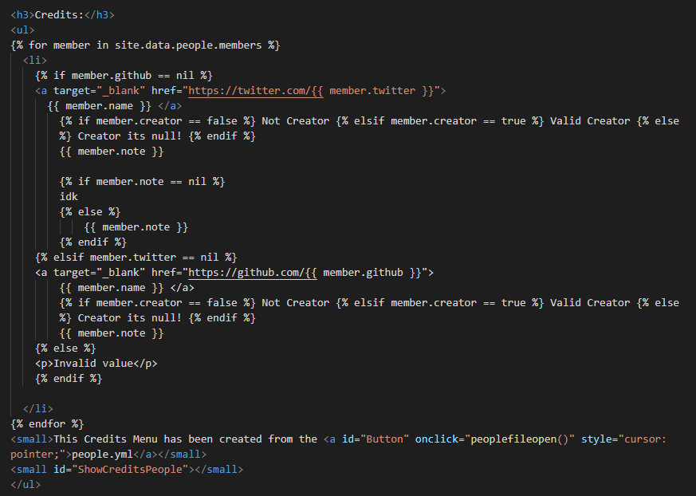

<i>This is mine... Minecraft Server Menu doesn't have anything about mojang here the project is totally mine in the end this file is not a virus it just starts the server as the User configures.</i>

<a href="https://github.com/gabrielramires/MinecraftServerMenu/blob/master/LICENSE"><i>GNU General Public License v2.0</i> License</a>

<h2>Pages:</h2>

<a href="Download">Download</a>\
<a href="Docs">Docs</a>\
<a href="Redirect?page=https://github.com/gabrielramires/MinecraftServerMenu/wiki">This menu can give me virus?</a> <i>-wiki page</i>

<h3>Credits:</h3>
<ul>

  <li>
    
    <a target="_blank" href="https://twitter.com/{{ member.twitter }}">
      {{ member.name }} </a>
         Not Creator  Valid Creator  Creator its null! 
        {{ member.note }}

        
        idk
        
            {{ member.note }}
        
    
    <a target="_blank" href="https://github.com/{{ member.github }}">
        {{ member.name }} </a>
         Not Creator  Valid Creator  Creator its null! 
        {{ member.note }}
    
    
Invalid value

    

  </li>

<small>This Credits Menu has been created from the <a id="Button" onclick="peoplefileopen()" style="cursor: pointer;">people.yml</a></small>
<small id="ShowCreditsPeople"></small>
</ul>

<!--
      LocalHost Disclaimer to work
-->



<h3><b>⚠ DISCLAIMER: ⚠</b></h3>
<li><b style="color: red;">maybe some things on the site don't work directly because of it running on LocalHost</b></li>
<li><b style="color: green;">Cool: the Disigne of the Website not changed.</b></li>
<li><b style="color: green;">Visit on Github the <a href="https://gabrielramires.github.io/MinecraftServerMenu">Original Website</a></b></li>
<i><small>(ignore this message just a warning. for developers and etc.)</small></i>


